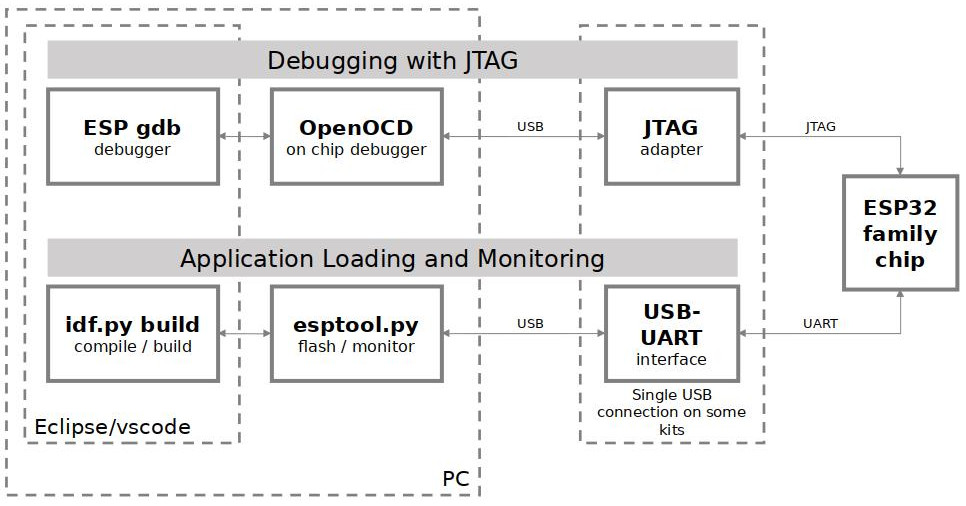

# Opensource toolchain tutorial for Espressif ESP32

ESP32 is a series of low-cost, low-power system on a chip microcontrollers with integrated Wi-Fi and dual-mode Bluetooth. The ESP32 series employs either a Tensilica Xtensa LX6 microprocessor in both dual-core and single-core variations, Xtensa LX7 dual-core microprocessor or a single-core RISC-V microprocessor and includes built-in antenna switches, RF balun, power amplifier, low-noise receive amplifier, filters, and power-management modules. ESP32 is created and developed by Espressif Systems, a Shanghai-based Chinese company, and is manufactured by TSMC using their 40 nm process. It is a successor to the ESP8266 microcontroller. 

Since the release of the original ESP32, a number of variants have been introduced and announced, includes ARM series ESP32, ESP32S2 / S3, and RISC-V series ESP32C3 / C6 / C5 / H2 / P4, etc.

ESP32 have very good official tutorials at https://docs.espressif.com/projects/esp-idf/en/latest/esp32/.

Please refer to "[Standard Toolchain Setup for Linux and macOS](https://docs.espressif.com/projects/esp-idf/en/latest/esp32/get-started/linux-macos-setup.html)" for Linux toolchain setup.

Since official documents is good enough, this tutorial is only a brief note for Linux.

# Table of contents
- [Hardware prerequiest](#hardware-prerequiest)
- [Toolchain overview](#toolchain-overview)
- [Compiler](#compiler)
- [SDK](#sdk)
  + [get ESP-IDF](#get-esp-idf)
  + [Install toolchains and tools](#install-toolchains-and-tools)
  + [Build blink demo](#build-blink-demo)
- [Programming](#programming)
  + [with esptool.py](#with-esptoolpy)
  + [with esp32-openocd](#with-esp32-openocd)
- [Debugging](#debugging)
  + [Install esp32-openocd](#install-esp32-openocd)
  + [JTAG pinout of ESP32 and ESP32 S2](#jtag-pinout)
  + [Launch OpenOCD](#launch-openocd)
  + [Debug](#debug)

# Hardware prerequiest
- A ESP32 devboard, S3 is recommended when this tutorial written, C3 is the RISC-V version.
- JTAG debugger for ESP32 and ESP32 S2, such as FTDI
  + NOTE 1: ESP32 doesn't support SWD interface, you can not use DAP-Link with ESP32.
  + NOTE 2: Only ESP32 and ESP32 S2 require an external JTAG debugger, ESP32 S3 / C3 and above have builtin jtag debug unit.

# Toolchain overview
- Compiler: xtensa (ARM) GNU Toolchain for ESP32 and ESP32S series, RISC-V GNU Toolchain for ESP32C series.
- SDK: ESP-IDF, **partial open source, most libraries of ble and wifi are released in binary form**
- Programming tool: esptool.py
- Debugging: ESP32 OpenOCD / gdb

# Compiler
It's not necessary to build the xtensa or RISC-V toolchain for various ESP32 chips, esp-idf already have toolchain integrated and will download it when setup the esp idf environment. you even have no need to care about where the toolchains installed, what you only need to know is the triplet of xtensa toolchain usually is **`xtensa-esp32xx-elf-`**, `esp32xx` means `esp32`, `esp32s2` and `esp32s3`, and the triplet of RISC-V toolchain usually is **`riscv32-esp-elf-`**.

These triplets will be used when you launch gdb to debug your program.

# SDK

ESP-IDF, the *Espressif Iot Development Framework* is the official standard SDK for ESP32 series. There are also a lot of thirdparty SDKs for different languagesd suchas micropython, luatos, etc, they all build upon ESP-IDF. you should learn ESP-IDF first.

## get ESP-IDF

```
mkdir -p ~/esp && cd ~/esp
git clone --recursive https://github.com/espressif/esp-idf.git
```

## Install toolchains and tools
After git clone finished, before you start using ESP-IDF, you need to setup toolchains and various other tools for it. ESP-IDF provide a helper script to make things easier

```
cd ~/esp/esp-idf
./install.sh esp32
```

It will download all esp32 toolchains and various other tools from github, and install them inside the user home directory: `$HOME/.espressif` on Linux.

If you prefer the Espressif download server when installing tools, you can use:

```
cd ~/esp/esp-idf
export IDF_GITHUB_ASSETS="dl.espressif.com/github_assets"
./install.sh esp32
```

After download and setup finished, you may found the `xtensa-esp32s3-elf-gcc` is not on your PATH. you need setup env vars first by:
```
. $HOME/esp/esp-idf/export.sh
```

If you plan to use esp-idf frequently, please append it to `~/.bashrc`.

## Build blink demo

There are a lot of examples in `esp-idf/examples`, using blink as example:

```
cp -r ~/esp/esp-idf/examples/get-started/blink ~
cd ~/blink
```

To build it with esp32  :

```
idf.py set-target esp32
idf.py build
```

To build it with esp32s3 :

```
idf.py set-target esp32s3
idf.py build
```

If you open `main/blink_example_main.c`, you may be curious about where the CONFIG_BLINK_GPIO defined for `#define BLINK_GPIO CONFIG_BLINK_GPIO`, it is defined in `sdkconfig` at current dir. you can run `idf.py menuconfig` to modify this `sdkconfig` file.

After built finished, there are various firmwares generated at `build` dir, it's not necessary to care about it for now, since the programming tool will handle them automatically.


# Programming

## with esptool.py

The upstream programming tool is `esptool.py`, it is already installed when we setup toolchains for esp-idf.

Usually an ESP32S3/C3 devboard has one or two USB port exported, one is UART, and another one is builtin JTAG debug unit, both can be used for programming, you can use `lsusb` to identify the USB ports after connecting devboard to PC USB port.

To programming the firmwares to target ESP32 device:
```
idf.py flash
```

After programming successfully, the WS2812 RGB LED on ESP32S3 devboard will blink. A lot of variant devboards may have no LED on board, please check the schematic of your devboard.

## with esp32-openocd
esp32-openocd can be used to upload firmware to target device by such command:

For esp32 with external JTAG debugger:
```
esp32-openocd -f <interface config> -f <path to>/esp32.cfg -c "program_esp build/blink.bin 0x10000 verify reset exit"
```

For esp32s3 with builting JTAG debug unit:
```
esp32-openocd -f /usr/share/esp32-openocd/openocd/scripts/board/esp32s3-builtin.cfg -c "program_esp build/blink.bin 0x10000 verify reset exit"
```

Refer to next section about how to connect the JTAG interface and how to build and use esp32-openocd.

# Debugging
The key software and hardware components that perform debugging of ESP32 with OpenOCD over JTAG (Joint Test Action Group) interface is presented in the diagram below:



Only ESP32 and ESP32 S2 require an external JTAG debugger. ESP32 S3 / C3 and above have builtin JTAG debug unit and it's not necessary to use external JTAG debugger with them (it does support external JTAG, but need burn eFues, and burning eFuses is an irreversible operation)

## Install esp32-openocd
Upstream openocd doesn't support debugging ESP32, you have to use Espressif forked version. 

When you setup ESP-IDF SDK, the `esp32-openocd` already installed in `~/.espressif/tools/openocd-esp32/<version>/openocd-esp32` dir. Since the command of esp32-openocd is also `openocd`, most likely it is conflict with the OpenOCD you installed systemwide, please make sure there is no confliction, or rename the esp32 openocd command to `esp32-openocd`.

If you want to build it from sources, follow below steps:
```
git clone https://github.com/espressif/openocd-esp32
cd openocd-esp32
git submodule update --init --recursive --progress

./bootstrap

./configure --prefix=/usr
  --disable-werror \
  --enable-esp-usb-jtag \
  --datadir=%{_datadir}/esp32-openocd \
  --program-prefix=esp32-
```

The openocd command for esp32 will be `esp32-openocd`.


## JTAG pinout

Refer to below table to wire up Jtag debugger with esp32 or esp32 s2:

| jtag | esp32   | esp32 s2 |
|------|---------|----------|
| TDO  | GPIO 15 | GPIO 40  |
| TDI  | GPIO 12 | GPIO 41  |
| TCK  | GPIO 13 | GPIO 39  |
| TMS  | GPIO 14 | GPIO 42  |

Since ESP32 S3 / C3 and above have builtin JTAG debug unit, I will not list JTAG pins of those chips and will not mention about how to use external JTAG debugger. Please refer to schematics of your devboard, use `lsusb` to figure out which port belongs to builtin JTAG and connect it to PC USB port, the `lsusb` output should look like:
```
303a:1001 Espressif USB JTAG/serial debug unit
```

## Launch OpenOCD

### For ESP32 and ESP32 S2

Since it requires external JTAG debugger, the jtag interface config file depends on which JTAG debugger you use. In this tutorial, I use FT2232D, launch esp32-openocd as:

```
esp32-openocd -f <path to>/ft2232d.cfg -f <find it from esp32-openocd installation dir>/esp32.cfg
```
### For ESP32 S3 / C3 and above

ESP32 S3 / C3 and above have builting JTAG debug unit, launch esp32 openocd for ESP32 S3 as:

```
esp32-openocd -f <find it from esp32-openocd installation dir>/esp32s3-builtin.cfg
```

Change `esp32s3-builtin.cfg` to `esp32c3-builtin.cfg` for ESP32 C3.

The openocd output of ESP32 S3 looks like:
```
Open On-Chip Debugger v0.12.0-esp32-20230221-15-g36a99294-dirty (2023-03-13-20:13)
Licensed under GNU GPL v2
For bug reports, read
        http://openocd.org/doc/doxygen/bugs.html
Info : only one transport option; autoselecting 'jtag'
Info : esp_usb_jtag: VID set to 0x303a and PID to 0x1001
Info : esp_usb_jtag: capabilities descriptor set to 0x2000
Warn : Transport "jtag" was already selected
Info : Listening on port 6666 for tcl connections
Info : Listening on port 4444 for telnet connections
Info : esp_usb_jtag: serial (F4:12:FA:FD:24:F4)
Info : esp_usb_jtag: Device found. Base speed 40000KHz, div range 1 to 255
Info : clock speed 40000 kHz
Info : JTAG tap: esp32s3.cpu0 tap/device found: 0x120034e5 (mfg: 0x272 (Tensilica), part: 0x2003, ver: 0x1)
Info : JTAG tap: esp32s3.cpu1 tap/device found: 0x120034e5 (mfg: 0x272 (Tensilica), part: 0x2003, ver: 0x1)
Info : starting gdb server for esp32s3.cpu0 on 3333
Info : Listening on port 3333 for gdb connections
Info : [esp32s3.cpu0] Debug controller was reset.
Info : [esp32s3.cpu0] Core was reset.
Info : [esp32s3.cpu1] Debug controller was reset.
Info : [esp32s3.cpu1] Core was reset.
Info : [esp32s3.cpu0] Target halted, PC=0x403791EE, debug_reason=00000000
Info : [esp32s3.cpu0] Reset cause (21) - (USB UART reset)
Info : [esp32s3.cpu1] Target halted, PC=0x403791EE, debug_reason=00000000
Info : [esp32s3.cpu1] Reset cause (21) - (USB UART reset)
```


## Debug

Since ESP32 have a seris different models, you should use the correct gdb command according to your chip:

- for ESP32: xtensa-esp32-elf-gdb
- for ESP32 S2: xtensa-esp32s2-elf-gdb
- for ESP32 S3: xtensa-esp32s3-elf-gdb
- for ESP32 C3/C6: riscv32-esp-elf-gdb

Using blink as example:
```
XXX-gdb build/blink.elf
```

When `(gdb)` prompt showed:
```
(gdb) target remote :3333
Remote debugging using :3333
0x40000400 in ?? ()
(gdb) break blink_led
Breakpoint 2 at 0x42007d0c: file /home/cjacker/esp/blink/main/blink_example_main.c, line 31.
(gdb) c
(gdb) c
Continuing.
[esp32s3.cpu1] Debug controller was reset.
[esp32s3.cpu1] Core was reset.
[esp32s3.cpu1] Target halted, PC=0x40041A76, debug_reason=00000000
[esp32s3.cpu1] Reset cause (3) - (Software core reset)
[esp32s3.cpu0] Target halted, PC=0x42007D70, debug_reason=00000001
Set GDB target to 'esp32s3.cpu0'
[esp32s3.cpu1] Target halted, PC=0x403791EE, debug_reason=00000000
[New Thread 1070174352]
[New Thread 1070176236]
[New Thread 1070178120]
[New Thread 1070165400]
[New Thread 1070169844]
[New Thread 1070163772]
[Switching to Thread 1070174352]

Thread 2 "main" hit Breakpoint 1, app_main () at blink_example_main.c:86
86              blink_led();
(gdb)
```


